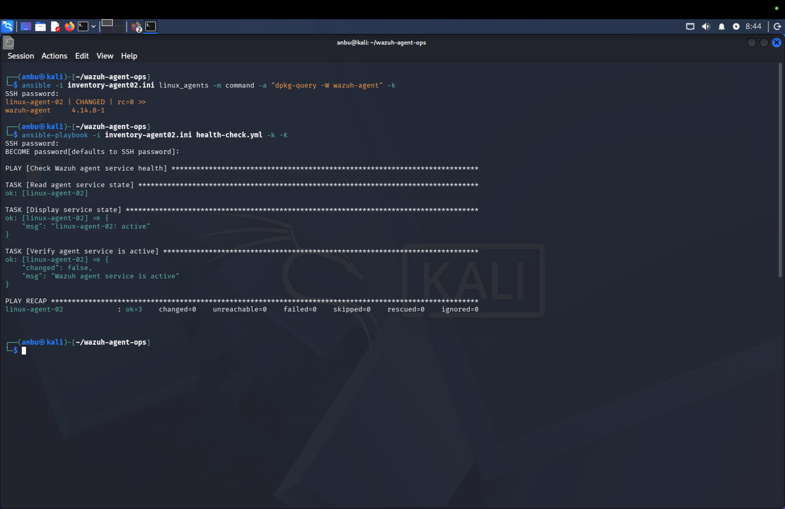
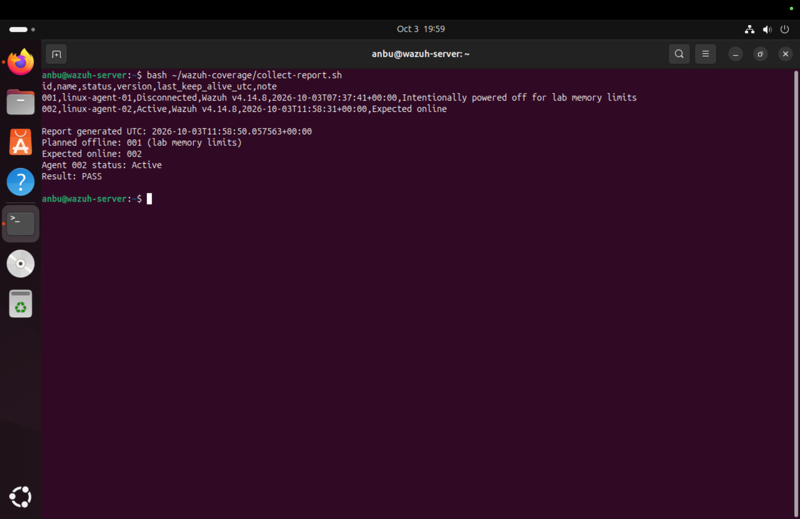
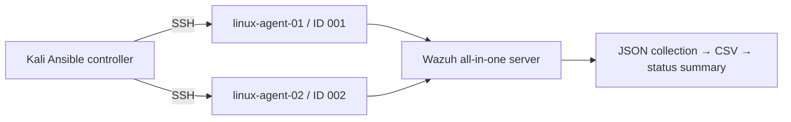

# Security Operations: Endpoint Lifecycle Automation with Wazuh and Ansible

An Ubuntu ARM64 lab demonstrating repeatable Wazuh agent deployment, service health checks, recovery, package rollback, and manager-side status reporting with Ansible and Python.

## Security operations skills demonstrated

- **Endpoint onboarding:** deploy a pinned agent package, enroll the endpoint, and confirm manager connectivity.
- **Operational reliability:** detect a stopped service, restore it, and verify repeated runs make no unnecessary changes.
- **Controlled change and rollback:** test a package downgrade and restore the baseline, validating service health and manager status.
- **Monitoring coverage:** distinguish planned downtime from an endpoint expected online and produce a repeatable status report.
- **Evidence and procedures:** retain test captures and document acceptance checks and known limitations.

**Status:** completed personal lab demonstration. The results below are backed by screenshots and source files; this project does not represent work performed for Visa.

## Demonstrated results

| Control | Observed result |
| --- | --- |
| Fresh installation on linux-agent-02 | Two successful tasks, two changes; enrolled as ID 002 |
| Repeat deployment | Two successful tasks, zero changes |
| Service health | Active; three successful tasks, zero changes |
| Controlled service outage on linux-agent-01 | Health assertion failed; Ansible restored service |
| Repeat recovery | Zero changes after recovery |
| Package rollback | 4.14.8-1 → 4.14.7-1; service active and manager connected |
| Version restoration | 4.14.8-1 installed; service active and manager connected |
| Coverage summary | PASS for active ID 002; ATTENTION REQUIRED for simulated disconnected CSV input |

## Selected evidence

[Deployment and repeat-run verification](evidence/screenshots/28-agent02-deployment-verification.png) · [Service outage detection](evidence/screenshots/19-health-check-detects-outage.png) · [Version rollback](evidence/screenshots/36-rollback-manager-verification.png)

[Browse all 39 evidence captures](docs/evidence.md)

## Related project

[Windows File Integrity Monitoring with Wazuh and AI-Assisted Triage](https://github.com/thmzhanbu/wazuh-fim-ai-triage) demonstrates file-change detection and analyst triage. This repository demonstrates deployment and maintenance of the agents that support monitoring. They are complementary lab projects; no automated integration between the two was demonstrated.

## Lab architecture

| Machine | Lab address | Role |
| --- | --- | --- |
| wazuh-server | 172.16.105.10 | Manager, indexer, dashboard; v4.14.8, reported revision rc2 |
| kali | 172.16.105.135 | Ansible controller |
| linux-agent-01 | 172.16.105.136 | Initial endpoint; intentionally powered off to conserve memory |
| linux-agent-02 | 172.16.105.138 | Automated installation and version maintenance endpoint |

Ubuntu endpoints use ARM64 and Ubuntu 24.04.5 LTS. VMware Fusion provides NAT networking on a Mac. Endpoint addresses are DHCP assignments and must be checked before reuse.

## Files

- `ansible/`: tested deployment, recovery, health and rollback playbooks; lab inventories.
- `reporting/`: manager-side collector and Python scripts.
- `evidence/screenshots/`: 39 original lab screenshots, indexed in [the evidence guide](docs/evidence.md).
- `evidence/reporting/`: imported JSON, CSV and summary snapshots.
- `docs/runbook.md`: operating procedures and acceptance checks.
- `docs/evidence.md`: evidence provenance and screenshot index.

## Start here

On Kali, install Ansible and its password-authentication dependencies, edit the inventory addresses and SSH username, and follow [the runbook](docs/runbook.md). The deployment DEB is pinned to 4.14.8-1 ARM64; update the manager address in the playbook for a different lab. Passwords are entered interactively with `-k -K`.

On the Wazuh manager, copy `reporting/` to a working directory and run `bash collect-report.sh` there. Python 3 uses only its standard library. The collector requires sudo access to `/var/ossec/bin/agent_control`.

## Scope and limitations

This is a two-endpoint learning lab, not a production deployment. Reporting explicitly expects ID 002 online and exempts ID 001 for planned downtime. PASS checks connection status only; it does not assert version compliance, event ingestion, freshness thresholds or security posture. The CSV generator assumes both enrolled IDs exist; a missing JSON record causes collection/report failure before the summary. There is no scheduling or external notification.

The health playbook checks the systemd service, while the manager report checks connectivity. A running service alone does not prove manager connectivity. The warning test used edited CSV input, not a live endpoint outage. Service outage and recovery were separately demonstrated on agent-01.

Deployment variables configure initial installation; these playbooks do not enforce ongoing configuration drift. Packages use official HTTPS URLs without a separate signature/checksum verification step. The rollback demonstrates a specific 4.14.8/4.14.7 package transition; a VM snapshot was retained as contingency but snapshot restoration was not demonstrated. The service task requests `started`, not a guaranteed restart after every package change.

Imported evidence is historical. JSON and CSV captures have different last-keep-alive timestamps; do not present them as one atomic collection. Regenerate current evidence with the collector when needed. Guest clocks differed; no recovery-duration claim is made.

## References

- [Wazuh upgrade guide](https://documentation.wazuh.com/current/upgrade-guide/index.html): manager must be the same version or newer than agents.
- [Agent control reference](https://documentation.wazuh.com/current/user-manual/reference/tools/agent-control.html)
- [Linux deployment variables](https://documentation.wazuh.com/current/user-manual/agent/agent-enrollment/deployment-variables/deployment-variables-linux.html)

Do not publish installer credential archives, passwords, private keys or enrollment keys. 
